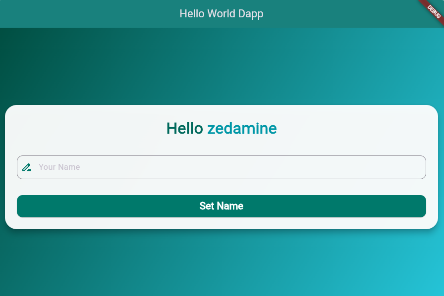
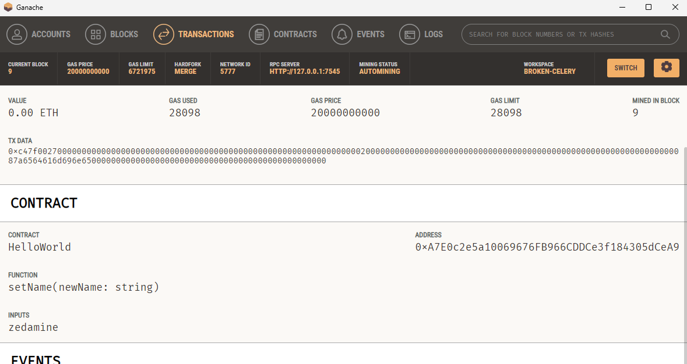

# Ethereum Blockchain Flutter DApp

A complete decentralized application (DApp) built with Flutter that interacts with an Ethereum smart contract on a local Ganache blockchain. This project demonstrates full-stack blockchain development with Flutter, Solidity, and Web3.js.

## 🎯 Project Overview

This project showcases a functional DApp that:
- Deploys a smart contract (`HelloWorld.sol`) to a local Ganache blockchain
- Provides a Flutter UI for web, desktop, and mobile platforms
- Reads and writes to blockchain state variables
- Uses conditional platform support: **web3.js** for web, **web3dart** for desktop/mobile

### Features
✅ Read contract state (`yourName` variable)  
✅ Write to contract state (`setName()` function)  
✅ Real-time blockchain interaction  
✅ Cross-platform support (Web, Android, iOS, Linux, macOS, Windows)  
✅ Private key-based account management  
✅ Transaction signing and execution  

---

## 🏗️ Project Structure

```
tp/
├── contracts/
│   └── HelloWorld.sol          # Smart contract with state variable and setter
├── migrations/
│   └── 2_deploy_contracts.js   # Truffle migration script
├── test/
│   └── helloWorld.js           # Smart contract unit tests
├── truffle-config.js           # Truffle configuration for Ganache
├── hello_world_dapp/           # Flutter application
│   ├── lib/
│   │   ├── main.dart           # App entry point with Provider setup
│   │   ├── contract_linking.dart # Blockchain integration layer
│   │   ├── helloUI.dart        # UI component with gradient background
│   │   └── test.dart           # Test utilities
│   ├── web/
│   │   ├── index.html          # Web entry point with web3.js CDN
│   │   ├── web3_client.js      # JavaScript bridge for Ganache interaction
│   │   ├── favicon.png
│   │   └── manifest.json
│   ├── android/                # Android platform code
│   ├── ios/                    # iOS platform code
│   ├── linux/                  # Linux platform code
│   ├── macos/                  # macOS platform code
│   ├── windows/                # Windows platform code
│   ├── pubspec.yaml            # Dart dependencies
│   ├── pubspec.lock
│   └── README.md
├── build/
│   └── contracts/
│       └── HelloWorld.json     # Compiled contract ABI and bytecode
├── src/
│   └── artifacts/
│       └── HelloWorld.json     # Contract artifact for Flutter
└── README.md                   # This file
```

---

## 🔧 Smart Contract (`HelloWorld.sol`)

```solidity
pragma solidity >=0.5.0;

contract HelloWorld {
    string public yourName;
    
    constructor() public {
        yourName = "Amine";
    }
    
    function setName(string memory newName) public {
        yourName = newName;
    }
}
```

**Features:**
- `yourName`: Public state variable (readable from blockchain)
- `setName(newName)`: Function to update the name on-chain

---

## 🚀 Setup & Installation

### Prerequisites
- **Flutter SDK** (v3.0+) - [Install Flutter](https://flutter.dev/docs/get-started/install)
- **Node.js & npm** - [Install Node.js](https://nodejs.org/)
- **Truffle** - `npm install -g truffle`
- **Ganache CLI** - `npm install -g ganache-cli`
- **Git** - [Install Git](https://git-scm.com/)

### Step 1: Clone the Repository
```bash
git clone https://github.com/zahdineamine2003/Etherium_Blockchain_Flutterapp.git
cd Etherium_Blockchain_Flutterapp/tp
```

### Step 2: Install Dependencies

**Blockchain Dependencies:**
```bash
npm install
```

**Flutter Dependencies:**
```bash
cd hello_world_dapp
flutter pub get
cd ..
```

### Step 3: Start Ganache
```bash
ganache-cli --deterministic --port 7545
```

**Output:**
```
Ganache CLI v6.x.x (ganache-core: x.x.x)

Available Accounts
==================
(0) 0x0a96E66a9B16F4C298B8c3F0dDDDA5669E782190 (default)
    Private Key: 0xa8b3e07073251fa2efeae617b2674f81fe3a05a0fdce072436f6dd5576cbeb18
...
Listening on 127.0.0.1:7545
```

**Keep this terminal open!**

### Step 4: Deploy Smart Contract
```bash
truffle migrate --network ganache
```

**Expected Output:**
```
Compiling your contracts...
Everything is up to date, compiling...
Deploying contracts with account 0x0a96E66a9B16F4C298B8c3F0dDDDA5669E782190
Deploying HelloWorld
HelloWorld: 0xA7E0c2e5a10069676FB966CDDCe3f184305dCeA9 ✔
```

### Step 5: Run Tests (Optional)
```bash
truffle test
```

### Step 6: Run Flutter App

**Web (Recommended):**
```bash
cd hello_world_dapp
flutter run -d edge
```

**Or use Chrome:**
```bash
flutter run -d chrome
```

**For other platforms:**
```bash
# Android (requires Android Studio/emulator)
flutter run -d android

# iOS (requires Xcode/simulator)
flutter run -d ios

# Linux, macOS, Windows (requires platform setup)
flutter run -d linux
flutter run -d macos
flutter run -d windows
```

---

## 📱 Application Screens

### Home Screen - Display Contract State
The app displays the current value of `yourName` from the blockchain:



**Features:**
- Displays current blockchain state ("zedamine")
- Loading spinner while fetching data
- Text input field for new name
- "Set Name" button to update blockchain state
- Beautiful teal gradient background
- Rounded card container with shadow

### Ganache Transaction History
When you update the name, a transaction is recorded in Ganache:



**Transaction Details Shown:**
- Block number where transaction was mined
- setName() function call with new value
- From address (account that signed transaction)
- To address (smart contract address)
- Gas used (28098 gas for name update)
- Transaction status (✓ Success)
- Contract interaction logs

---

## 🔐 Blockchain Configuration

### Ganache Settings
- **Network ID**: 1337/5777
- **RPC Server**: `http://127.0.0.1:7545`
- **Account Address**: `0x0a96E66a9B16F4C298B8c3F0dDDDA5669E782190`
- **Private Key**: ⚠️ *Keep private keys secure - never commit to repository*
- **Contract Address**: `0xA7E0c2e5a10069676FB966CDDCe3f184305dCeA9`

### truffle-config.js
```javascript
module.exports = {
  networks: {
    ganache: {
      host: "127.0.0.1",
      port: 7545,
      network_id: "*",
    },
  },
  compilers: {
    solc: {
      version: "0.5.16",
    },
  },
};
```

---

## 🛠️ Technology Stack

### Frontend
| Technology | Purpose |
|-----------|---------|
| **Flutter** | Cross-platform mobile & web UI |
| **Provider** | State management |
| **web3dart** | Ethereum interaction (desktop/mobile) |
| **web3.js** | Ethereum interaction (web) |

### Blockchain
| Technology | Purpose |
|-----------|---------|
| **Solidity** | Smart contract language |
| **Truffle** | Contract development framework |
| **Ganache** | Local blockchain emulator |
| **JavaScript Bridge** | Dart ↔ Web3.js communication |

### Key Dependencies

**pubspec.yaml:**
```yaml
dependencies:
  flutter:
    sdk: flutter
  provider: ^6.0.0
  web3dart: ^2.6.1
  http: ^1.1.0
  web_socket_channel: ^2.4.0
  js: ^0.6.7              # JS interop for web3.js
  
dev_dependencies:
  flutter_test:
    sdk: flutter
```

---

## 📂 Core Files Explained

### `lib/contract_linking.dart`
**Purpose**: Main blockchain integration layer using the Provider pattern

**Key Methods**:
```dart
// Initialize blockchain connection (web or desktop/mobile)
initialSetup()

// Read contract state
getName() -> String (returns "zedamine")

// Write to contract state
setName(String newName) -> Transaction
```

**Platform Handling**:
- **Web**: Uses web3.js via JavaScript interop
- **Desktop/Mobile**: Uses web3dart directly

### `web/web3_client.js`
**Purpose**: JavaScript bridge for web3.js interaction with Ganache

**Key Functions**:
```javascript
// Initialize web3 with private key
initializeWeb3()

// Read state variable
async getName()

// Write to contract and sign transaction
async setName(newName)
```

### `lib/helloUI.dart`
**Purpose**: UI component displaying contract state and input form

**Features**:
- Gradient teal background
- Loading indicator
- Display current name from blockchain
- Text input for new name
- "Set Name" button to trigger transaction

### `web/index.html`
**Purpose**: Web entry point with web3.js library

```html
<!-- Load web3.js from CDN -->
<script src="https://cdn.jsdelivr.net/npm/web3@1.10.0/dist/web3.min.js"></script>
<!-- Load our JavaScript bridge -->
<script src="web3_client.js"></script>
```

---

## 🔄 How the App Works

### Flow Diagram: Reading Contract State

```
Flutter App (Dart)
    ↓
contract_linking.getName()
    ↓
[kIsWeb check]
    ├─ TRUE: Call web3Client.getNameForDart() via JS
    │   ↓
    │ web3_client.js
    │   ↓
    │ web3.eth.Contract.call(yourName)
    │   ↓
    │ Ganache RPC http://127.0.0.1:7545
    │   ↓
    │ Returns: "zedamine"
    │
    └─ FALSE: Use web3dart directly
        ↓
      web3dart client
        ↓
      Ganache RPC
        ↓
      Returns: "zedamine"
    ↓
Update UI with result
```

### Flow Diagram: Writing to Contract State

```
Flutter App (Dart)
    ↓
contract_linking.setName("ali")
    ↓
[kIsWeb check]
    ├─ TRUE: Call web3Client.setNameForDart("ali") via JS
    │   ↓
    │ web3_client.js
    │   ↓
    │ Sign transaction with private key
    │   ↓
    │ web3.eth.sendSignedTransaction()
    │   ↓
    │ Ganache processes & mines block
    │   ↓
    │ Returns receipt with txHash
    │
    └─ FALSE: Use web3dart directly
        ↓
      Sign with credentials
        ↓
      Send signed transaction
        ↓
      Ganache mines block
        ↓
      Returns receipt
    ↓
Refresh display by calling getName()
```

---

## 🧪 Testing

### Unit Tests (Smart Contract)
```bash
cd tp
truffle test
```

**Test Output:**
```
  HelloWorld Contract
    ✓ should have initial name "Amine"
    ✓ should set name to new value
    ✓ should update name multiple times
```

### Manual Testing (UI)
1. Open app - displays "Hello zedamine"
2. Enter "ali" in text field
3. Click "Set Name"
4. Check Ganache - new transaction appears
5. App refreshes - displays "Hello ali"

---

## 🐛 Troubleshooting

### Issue: "Error getting name: NoSuchMethodError"
**Solution**: Ensure Ganache is running on `http://127.0.0.1:7545`

### Issue: "Contract address not found"
**Solution**: Run `truffle migrate --network ganache` to deploy contract

### Issue: "Web3 library not loaded" (web only)
**Solution**: Check that web3.js CDN is accessible and `web3_client.js` is in `web/` folder

### Issue: "Cannot connect to localhost:7545"
**Solution**: 
- Ensure Ganache is running: `ganache-cli --deterministic --port 7545`
- Check firewall settings
- Verify port 7545 is not in use

### Issue: Flutter build fails
**Solution**:
```bash
flutter clean
flutter pub get
flutter pub upgrade
flutter run
```

---

## 📚 Learning Resources

- [Flutter Documentation](https://flutter.dev/docs)
- [Web3.js Documentation](https://web3js.readthedocs.io/)
- [Web3dart Documentation](https://pub.dev/packages/web3dart)
- [Solidity Documentation](https://docs.soliditylang.org/)
- [Truffle Documentation](https://www.trufflesuite.com/docs)
- [Ganache Documentation](https://www.trufflesuite.com/docs/ganache/overview)

---

## 🎓 Key Concepts Demonstrated

### 1. Smart Contract State Management
- Public state variables readable from blockchain
- State-modifying functions (transactions)
- Private key signing for transactions

### 2. Cross-Platform Blockchain Integration
- Conditional platform-specific code (`kIsWeb`)
- Web3.js for browser/web environment
- Web3dart for native platforms

### 3. Asynchronous Communication
- Polling mechanism for JavaScript Promise handling
- Async/await for blockchain operations
- State updates after transaction confirmation

### 4. UI/UX Patterns
- Loading states during blockchain calls
- Real-time state display
- User input for blockchain transactions
- Gradient backgrounds and Material design

---

## 🚀 Future Enhancements

- [ ] Multiple contract interactions
- [ ] MetaMask wallet integration
- [ ] Transaction history view
- [ ] Gas estimation and optimization
- [ ] Event listening (contract logs)
- [ ] Multi-wallet support
- [ ] NFT minting functionality
- [ ] DeFi protocol integration

---

## 📝 License

This project is open source and available under the MIT License.

---

## 👤 Author

**Zahdine Amine**  
GitHub: [@zahdineamine2003](https://github.com/zahdineamine2003)

---

## 🤝 Contributing

Contributions are welcome! Please feel free to submit a Pull Request.

1. Fork the repository
2. Create your feature branch (`git checkout -b feature/AmazingFeature`)
3. Commit your changes (`git commit -m 'Add some AmazingFeature'`)
4. Push to the branch (`git push origin feature/AmazingFeature`)
5. Open a Pull Request

---

## 📞 Support

For issues or questions, please open an issue on [GitHub Issues](https://github.com/zahdineamine2003/Etherium_Blockchain_Flutterapp/issues)

---

## ✨ Acknowledgments

- Flutter community for excellent documentation
- Truffle Suite for smart contract tools
- Ganache for local blockchain simulation
- Web3.js and Web3dart teams for blockchain libraries

---

**Last Updated**: December 2025  
**Version**: 1.0.0
